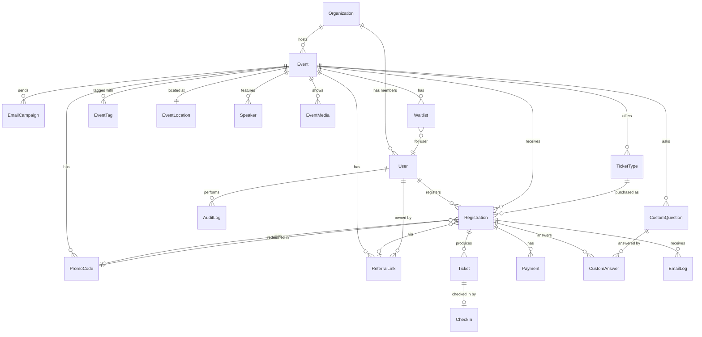

# EventFlow — Database ERD

## Entity Relationship Diagram (Mermaid)

## Tables (summary)

| Table             | Purpose                                                  |
|-------------------|----------------------------------------------------------|
| organizations     | Tenant/org account (clubs, businesses, nonprofits)       |
| users             | Anyone with an account (attendee/organizer/staff/admin)  |
| events            | Single event instance                                    |
| event_locations   | Address, lat/lng, Google Place ID                        |
| event_media       | Banner, gallery photos, promo video                      |
| speakers          | Speaker bio + photo (per event)                          |
| event_tags        | Free-form tags                                           |
| ticket_types      | Free, GA, Early Bird, VIP, Student, Group, Custom         |
| custom_questions  | Per-event registration questions                          |
| custom_answers    | Attendee responses                                        |
| registrations     | Order header (one per attendee group)                     |
| tickets           | Individual seat — one QR per row                          |
| payments          | Stripe charge / refund records                            |
| promo_codes       | Discounts (% or $) with limits & expiry                   |
| referral_links    | Trackable share links                                     |
| referral_clicks   | Click + conversion telemetry                              |
| check_ins         | Scan events                                               |
| waitlist          | Capacity overflow queue                                   |
| email_logs        | Every send: type, status, opened, clicked                  |
| email_campaigns   | Organizer broadcast definitions                           |
| audit_logs        | Org/staff actions (security)                              |
| abandoned_carts   | Recovery tracking                                         |
| sessions          | Refresh-token store (optional; JWT can be stateless)      |

See `prisma/schema.prisma` for column-level definitions including types, indexes, and constraints.

## Key Indexes

- `events(slug)` unique
- `events(organization_id, start_at)`
- `registrations(event_id, status)`
- `tickets(qr_code_hash)` unique
- `users(email)` unique
- `promo_codes(event_id, code)` unique
- `referral_links(code)` unique
- `check_ins(ticket_id)` unique (prevents double check-in)

## Constraints / Business Rules

- A `Ticket` row is created only after `Registration.status = CONFIRMED`.
- `CheckIn` table has unique constraint on `ticket_id` → enforces single check-in.
- `Waitlist.position` is recomputed on insert/delete via trigger.
- Soft delete: `deleted_at` on users, events, registrations.
